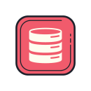

### Hey there 👋 I'm Taher. 😎

### What I'm good at...

      

### What I'm learning...

  

### You can follow me here (if you like) ➡️   

### You can contact me here ➡️ 

### Check out some of my projects below 👇👇

<!--
**tahersaraf/tahersaraf** is a ✨ _special_ ✨ repository because its `README.md` (this file) appears on your GitHub profile.

Here are some ideas to get you started:

- 🔭 I’m currently working on ...
- 🌱 I’m currently learning ...
- 👯 I’m looking to collaborate on ...
- 🤔 I’m looking for help with ...
- 💬 Ask me about ...
- 📫 How to reach me: ...
- 😄 Pronouns: ...
- ⚡ Fun fact: ...
-->
